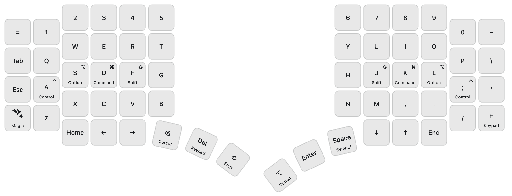
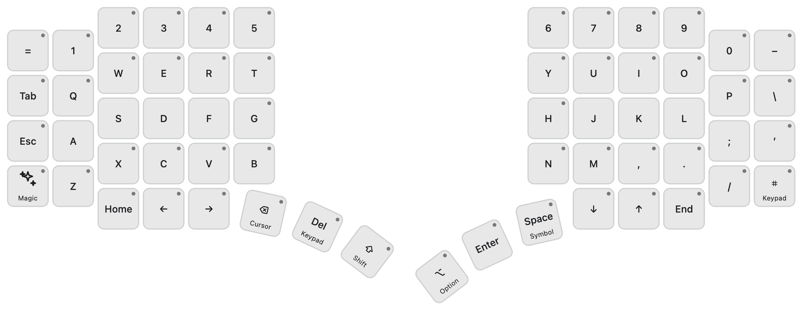
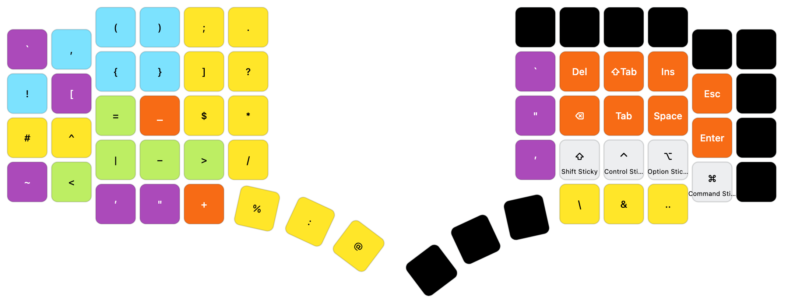
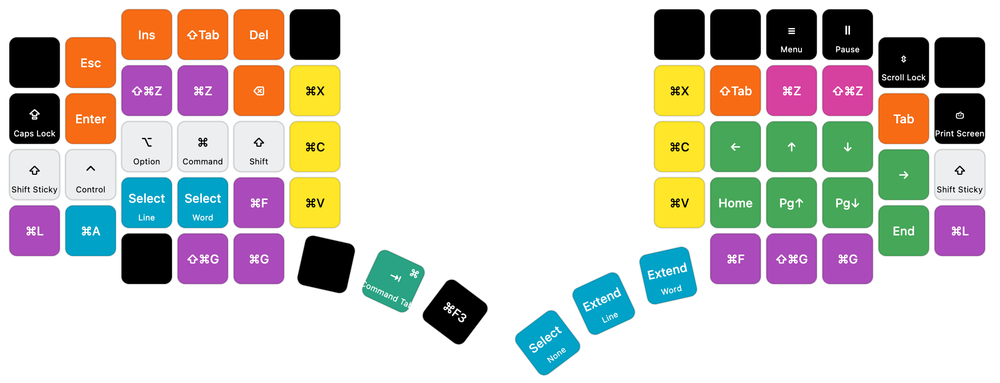
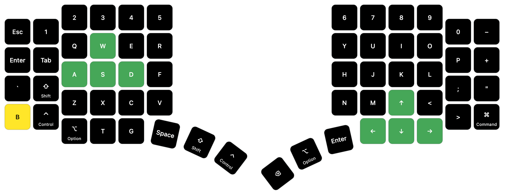
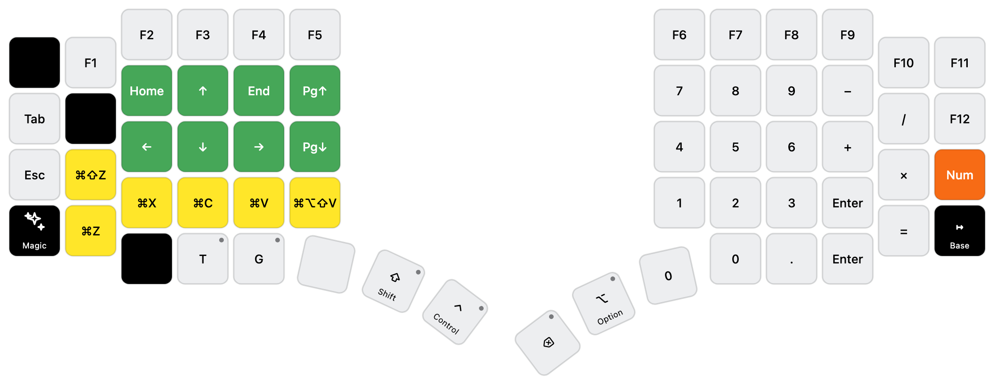
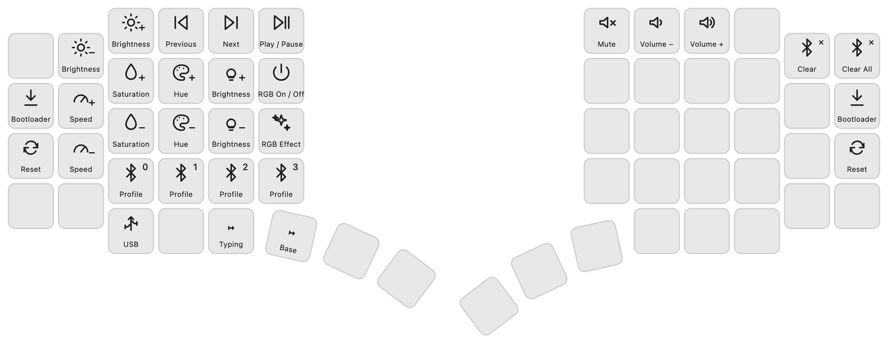

# Go60 keyboard layout

My personal firmware for the Moergo Go60 layout
Open the [interactive layer map](./layout-preview.html).

## Layers

### Base



### Typing



### Symbol



### Cursor



### Gaming



### Keypad



### Magic



## Build

```sh
./build.sh
```

## Flash

```sh
./flash.sh
```
